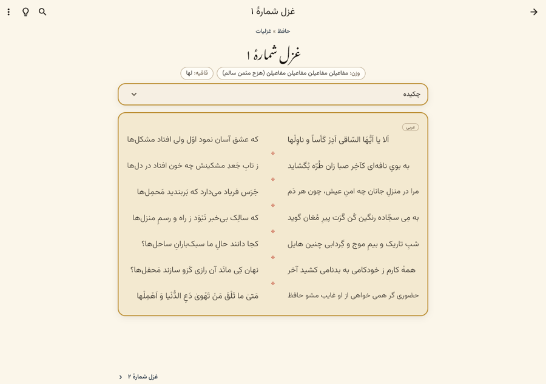
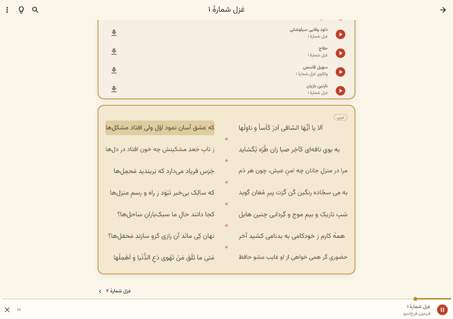
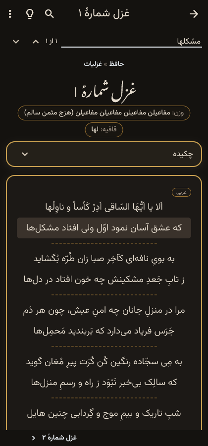

# گنج

**خواندن و شنیدن شعر پارسی، روی هر دستگاه، حتی بی‌اینترنت — به پاس گنجور**

  <a href="https://github.com/aminkvh/Ganj/releases/latest"><b>Download · دریافت</b></a>
  &nbsp;·&nbsp; Android · iOS · macOS · Windows · Linux

| | | |
|---|---|---|
|  |  |  |

## گنج چیست؟

[گنجور](https://ganjoor.net) گنجینه‌ای بی‌همتاست: دیوان صدها شاعر، خوانش‌ها، معنی ابیات و نسخه‌های خطی، که
به همت حمیدرضا محمدی و صدها داوطلب فراهم آمده است. اما گنجور بیشتر یک وبگاه است: بی‌اینترنت در دسترس نیست
و روی گوشی و رایانه تجربهٔ یک برنامه را ندارد.

**گنج** برنامه‌ای آزاد و رایگان است که همین گنجینه را به اندروید، آی‌اواس، مک، ویندوز و لینوکس می‌برد:
با ظاهری نزدیک به گنجور، خواندن و جستجوی بی‌اینترنت (با بارگیری دیوان هر شاعر)، پخش خوانش‌ها همگام با متن،
نشان و یادداشت روی همین دستگاه، نقشهٔ خاستگاه سخنوران، قفسهٔ کتاب‌ها، و ترجمهٔ ماشینی ابیات. هدف ساده است:
دسترس‌پذیرتر کردن شعر پارسی برای همه، و پاسداشت گنجور.

**گنج برنامه‌ای غیررسمی است و وابسته به گنجور نیست.** همهٔ شعرها، خوانش‌ها، معنی‌ها و تصاویر از گنجور و
همکارانش است. اگر از گنج لذت می‌برید، [از گنجور حمایت کنید](https://ganjoor.net).

## What is Ganj?

[Ganjoor](https://ganjoor.net) is a treasure: the works of hundreds of Persian poets, with recitations, plain-Persian
meanings of verses and manuscript images, built by Hamidreza Mohammadi and hundreds of volunteers. But it is mostly a
website: it isn't available offline, and it doesn't feel like an app on phones and computers.

**Ganj** is a free, open-source app that brings that treasure to Android, iOS, macOS, Windows and Linux. It looks
close to Ganjoor, reads and searches offline (download a poet's collection once), plays recitations with the
verse highlighted as it is read, keeps bookmarks and notes on your device only, and has the poets' birthplace map,
the bookshelf, an English interface and machine translation of verses. The goal is simple: make Persian poetry
more accessible to everyone, as a hat-tip to Ganjoor.

**Ganj is unofficial and not affiliated with or endorsed by Ganjoor.** All poems, recitations, meanings and images
come from Ganjoor and its contributors. If you enjoy Ganj, please [support Ganjoor](https://ganjoor.net).

## Credits & license

- Content: [Ganjoor](https://ganjoor.net) (via its public API and poet packs), founded by Hamidreza Mohammadi and
  built by many volunteers; each recitation belongs to its reciter.
- Code: **GPL-3.0-or-later** (see [`LICENSE`](LICENSE)), like Ganjoor's own
  [GanjoorService](https://github.com/ganjoor/GanjoorService). Third-party notices: [`NOTICE.md`](NOTICE.md).

## Build

Flutter 3.47+: `flutter pub get`, `flutter test`, then `flutter run -d <windows|macos|linux|android|ios>`.
Releases are built by [`.github/workflows/release.yml`](.github/workflows/release.yml) when a `v*` tag is pushed.
